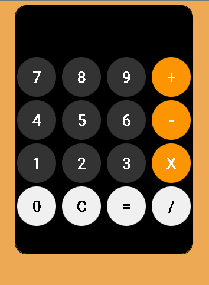

# Calculadora Web
[🇺🇸 English](README.md) | [🇪🇸 Español](README-es.md)

Una calculadora web funcional desarrollada con HTML, CSS y JavaScript. Este proyecto tiene como objetivo ayudarte a aprender y mejorar tus habilidades de desarrollo web.

## Características Clave

- Realiza operaciones aritméticas básicas.
- Interfaz amigable y fácil de usar.
- Desarrollada con HTML, CSS y JavaScript.

## Requisitos

- Navegador web moderno compatible con HTML5.

## Uso

1. Descarga los archivos HTML y CSS en tu máquina.
2. Abre el archivo `index.html` en tu navegador.

## Capturas de Pantalla

## Licencia

Este proyecto no tiene una licencia específica y es solo para fines de aprendizaje personal.

---

Desarrollado por Jese Jostmar Alfonso Alejandro

Proyecto alojado en: https://github.com/JostmarDev/Calculator